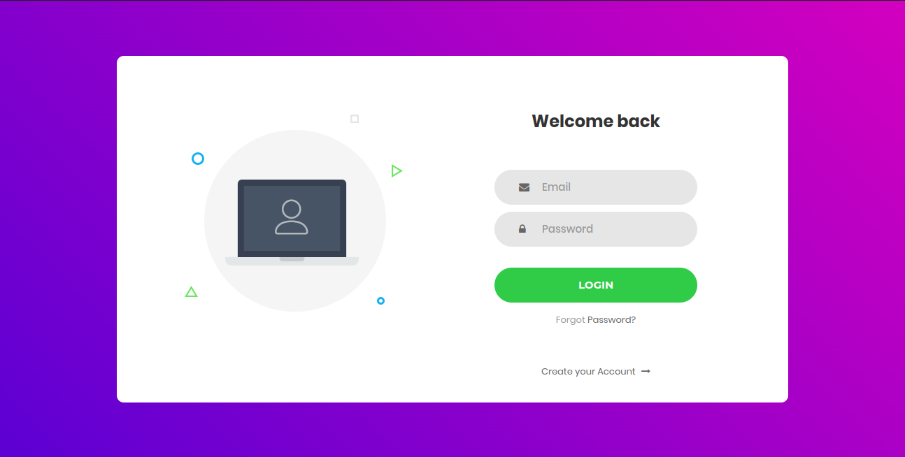
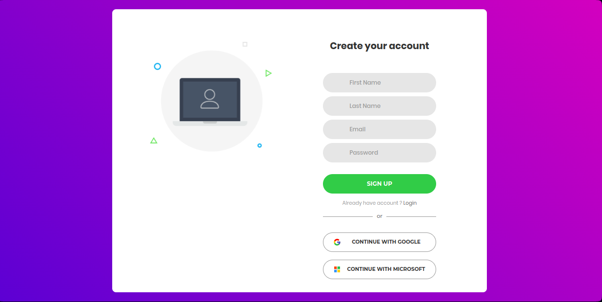
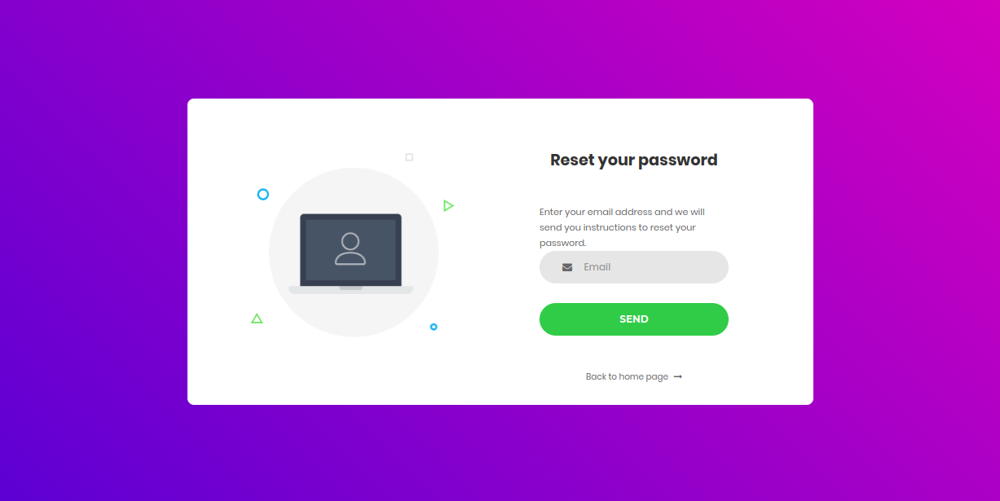

# Django Authentication System

This project is an advanced authentication system built using Django, designed to provide secure and reliable user authentication for web applications. The system implements essential authentication features and adheres to best practices to ensure the security and privacy of user data.

## Features

- **User Registration**: Allows new users to create accounts with unique usernames and passwords.
- **User Login**: Enables users to log in with their registered credentials.
- **Password Reset**: Provides users with the ability to reset their passwords if forgotten.
- **Email Verification**: Sends verification emails to users upon registration to confirm their email addresses.
- **Secure Password Storage**: Utilizes Django's built-in password hashing mechanisms for secure password storage.
- **User Profile Management**: Allows users to update their personal information and account details.
- **Session Management**: Manages user sessions securely to ensure authenticated access to protected areas of the application.
- **Two-Factor Authentication**: Enhances security by adding an optional two-factor authentication feature.

## Technologies Used

- **Django**: A high-level Python web framework that encourages rapid development and clean, pragmatic design.
- **SQLite**: Default database used for development purposes. Can be replaced with other databases like PostgreSQL or MySQL for production.
- **HTML/CSS**: For front-end styling and layout.
- **JavaScript**: Enhances user experience with dynamic features.
- **Bootstrap**: Provides responsive design and styling.

## Screenshots

### Login Page

### Sign Up Page

### Password Reset

### Video Screen Testing

## Technologies Used

- **Django**: A high-level Python web framework that encourages rapid development and clean, pragmatic design.
- **SQLite**: Default database used for development purposes. Can be replaced with other databases like PostgreSQL or MySQL for production.
- **HTML/CSS**: For front-end styling and layout.
- **JavaScript**: Enhances user experience with dynamic features.
- **Bootstrap**: Provides responsive design and styling.
